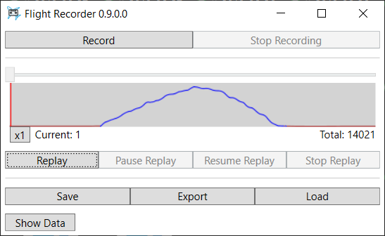

## Flight Recorder

A simple recorder to record and replay flight in Microsoft Flight Simulator.

### Features

- Record and replay in the sim
- Save recording into a file and load it on another computer
- Quickly jump to any place in your recording (you have to start replay and then pause replay first)
- The tool records this list of variables from SimConnect [Structs.cs](FlightRecorder.Client.SimConnectMSFS/Structs.cs) for each sim frame. Some of them are only for analysis and display and don't affect replay.

### Current Limitations and Other Notes

- I don't know a reliable way to tell if an engine is running or not, so this tool cannot auto-start an engine. Hence, you should start recording when engine is already running and stop recording before turning off the engine.
- Replay is not very smooth at the moment, especially when turning on the ground. I'm still experimenting with different ways to perform the replay to find the best one.
- To prevent fighting with MSFS own calculation, the tool sends freeze command when you start replay and unfreeze when you stop. This means it might conflict with other tools leverating the same feature (e.g. YourControl when you are not in control, other replay tools).

### Issues

Please report any issues or feature request in GitHub Issues https://github.com/nguyenquyhy/Flight-Recorder/issues. 